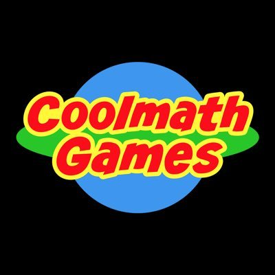

# Author 
**Name:** Carlos Zamora

**Date:** 09/04/26

## Practice Markdown Formatting

### Headers 
There are 6 different header sizes corresponding to the number of "#" you include before text. Be sure to include a space separating the title and "#". 

### Emphasis 

**Bold text** - Use two star symbols for bold text.

*Italic text* - Use one star symbols for italic text.

***Bold and italic text*** - Use three star symbols for both bold and italic text

##### Example: **Hi, This right here is bold text!**

### Lists

##### Unordered List

- Wash car
- pick up package 
- doctor appointment 

##### Ordered List

1. brush teeth
2. eat breakfast
3. start homework

##### Nested List 

- Setting
- Character
  - Hair color
  - clothing color
  - height
  - weight
- Time period

### Links

##### Basic Link to Cool Math Games: [Cool Math Games](https://www.coolmathgames.com/)

##### Links With Titles: [Cool Math Games (hover me)](https://www.coolmathgames.com/ "Visit Cool Math Games")

##### Reference-Style Links: 
[Cool Math Games][CMG link] is a fun website!

[CMG link]: https://www.coolmathgames.com/

##### Images As Links:

[](https://www.coolmathgames.com/)

### Blockquotes

> "Whatever you do, work at it with all your heart, as working for the Lord, not for human masters."
> - Colossians 3:23

### Code Blocks:

##### Inline Code: 
Using single backticks I am able to create inline code. 

Example: Here I am using `inline code` in a line.

##### Code Block:
Using triple backticks I am able to create a code block.

Example: 

```
All of this text here is part of a code block.
In order to close this code block I must end it with another 3 backticks

```
### Tables
|P/C | Chess | Gaming | 
|----------|----------|----------|
| Pros | Cognitive boost | Reaction time improvement |
| Cons| hard to master | bad on the eyes |

### Task List:
- [x] Wash dishes
- [x] wash clothes
- [ ] Complete Hw
- [x] Pick up Sibling 


### Footnotes

Here is a footnote about chess and my experience. [^1]
[^1]: Chess is a game I started playing in high school during my Sophomore year. What I enjoyed most about it is how simple the piece movements are, but yet how challenging it can be with so many versions of a single game. I used to be in the chess team in high school and even participated in a school tournament. Soon after that, I stopped play chess for a while but I recently picked up the hobby again and I am enjoying re-learning/learning new things about the game. Ive tried replacing gaming with chess, as I wanted something that didn't involve using screens. 


